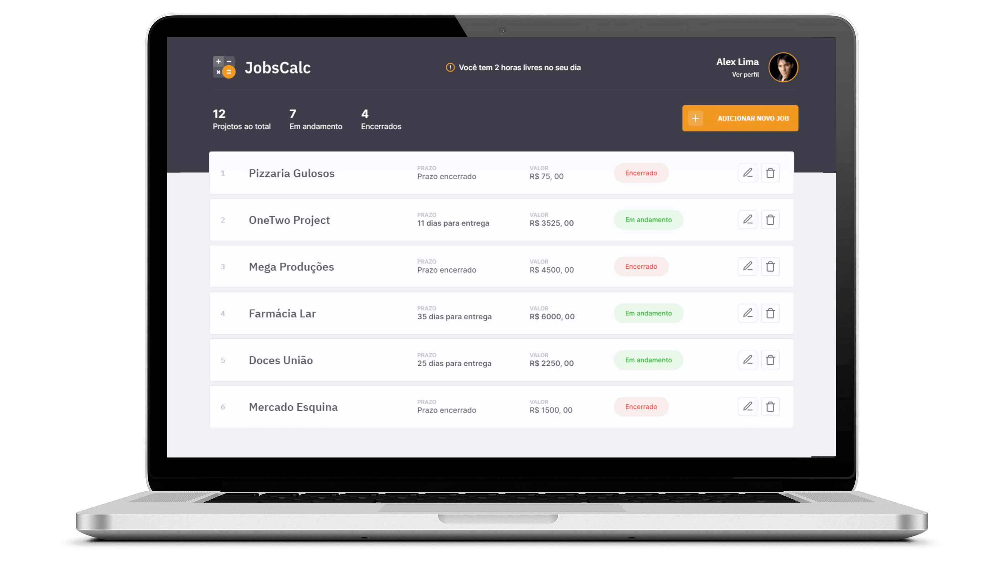
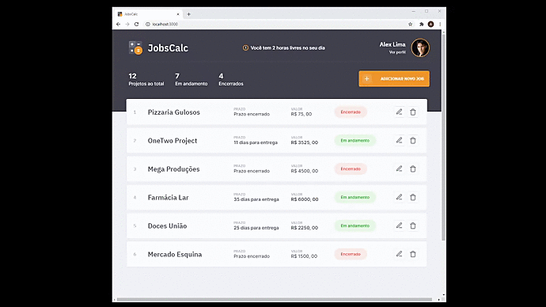
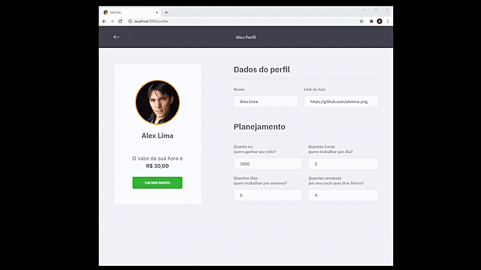
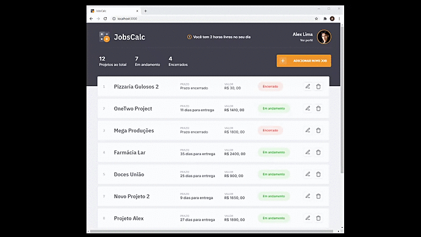

<!-- ------- Logo --------------->
<h1 align="center">
  
</h1>
<!-- ------- Ancoras --------------->
<p align="center">
  <a href="#-sobre">Sobre</a>&nbsp;&nbsp;&nbsp;|&nbsp;&nbsp;&nbsp;
  <a href="#-projeto">Projeto</a>&nbsp;&nbsp;&nbsp;|&nbsp;&nbsp;&nbsp;
  <a href="#-telas">Telas</a>&nbsp;&nbsp;&nbsp;|&nbsp;&nbsp;&nbsp;
  <a href="#-tecnologias">Tecnologias</a>&nbsp;&nbsp;&nbsp;|&nbsp;&nbsp;&nbsp;
  <a href="#-layout">Layout</a>&nbsp;&nbsp;&nbsp;|&nbsp;&nbsp;&nbsp;
  <a href="#-licença">Licença</a>
</p>

<!---------- Badges ----------------->  
<p align="center">


 

 

   

   
  <!----(4953b8)--BluePurple -->
  <!----(49AA26)--Green -->
  <!----(008ed6)--Blue -->
  <!----(3292a6)--BlueMedium-->
  <!----(444)-----BlackMedium-->
  <!----(F1972C)--Orange-->
</p>
<br>

<!---------- showcase  ----------------->  
<p align="center">
  
</p>

<!----- Acess Deploy Demonstration-->
 <!--h5 align="center">
    🎬 Clique Aqui: &nbsp; <a href="https://glozzom-nine.vercel.app/">  Visualizar Demonstração </a> 
 </h5 -->

<!----- Description ------------------>
## 🔖 Sobre
&nbsp;&nbsp;&nbsp;&nbsp;Este Projeto faz parte de um evento que participei, da **Maratona-Discovery2** da Rocketseat, Foi uma semana de maratona de estudos sobre desenvolvimento Web(Front-End), em sua 2° edição. 
  Nesta edição desenvolveremos um projeto denominado **JobsCall**, sendo um site Web responsivo de controle e calculo de prazos e custos de servicos ou projetos.

<br>

## 💻 Projeto

 &nbsp;&nbsp;&nbsp;&nbsp;O  **JobsCalc** é uma aplicação de estimativa de cálculo para projetos freelancer, onde é possível cadastrar e excluir jobs (projetos), obtendo uma estimativa de custo de cada job. Além disso, é possível traçar o valor da hora da pessoa que estará usando o sistema 💰

<br>

###### **Evento :** Maratona -Discovery 2ª Edição - [Rocketseat](https://rocketseat.com.br)
###### **Instrutores :** "Mayk Brito" e "Jakeliny"

<br>

<!----- Showcase Screens Shot------------------>
## 💻 **Telas**

<div align="center">




</div>
<br>
<br>

<!----- Configurations ---------------------------->
## 📌 Instruções : 

Para iniciar o Servidor da aplicação use o comando: **_npm run dev_** então acesse pelo navegador **_http://localhost:3000/_** 

<br>

##  🚀 Tecnologias

Esse projeto foi desenvolvido com as seguintes tecnologias:

- [HTML5](https://pt.wikipedia.org/wiki/HTML5) - Hyper Text Markup Language - linguagem de marcação de hipertexto.
- [CSS3](https://pt.wikipedia.org/wiki/CSS3) - Cascading Style Sheets - estilização de código html.
- [Java Script](https://www.javascript.com/) - Linguagem de programação utilizada em páginas web. Com o JS.
- [Node.js](https://nodejs.org/en/) - Ambiente de execução Javascript server-side.
- [EJS](https://ejs.co/) - Embedded JavaScript templating - Motor de redenrização
- [VS Code](https://code.visualstudio.com/) - Editor de desenvolvimento de aplicações web.
- [Express](https://expressjs.com/pt-br/) - Framework para aplicativo da web do Node.js
- [SQLite](https://www.sqlite.org/index.html) - biblioteca em linguagem C que implementa um mecanismo de banco de dados SQL.
<br>

## 🔖 Layout

Você pode visualizar o layout do projeto através [desse link](https://www.figma.com/file/s4fytPFbDiSkv4GPSfKaLE/Jobs-Planning). É necessário ter conta no [Figma](https://figma.com) para acessá-lo.

## 📝 Licença
<a href="https://opensource.org/licenses/MIT">
    
</a>

 <!--&nbsp;&nbsp;&nbsp;&nbsp;Esse projeto está sob a licença MIT. Veja o arquivo [LICENSE](https://opensource.org/licenses/MIT) para mais detalhes. -->

&nbsp;&nbsp;&nbsp;&nbsp;Esse projeto está sob a licença MIT. Veja o arquivo [LICENSE](.github/LICENSE.md) para mais detalhes.
 <br>

## 📁 Como Baixar o Projeto

```bash
  # Clonar o repósitorio
  $ git clone https://github.com/alxlima/JobsCalc.git
  
  # Entrar no diretório
  $ cd c:/maratona-discover2

  # Instalar as dependências
  $ npm install
  
  # Iniciar o Projeto
  $ npm run dev
```
#
 Desenvolvido 🚀 por: ***_Alex Sandro da Silva lima_***


[](https://www.linkedin.com/in/alex-sandro-da-silva-lima-8b297839/) 
[](mailto:alex_lima2013@hotmail.com)
